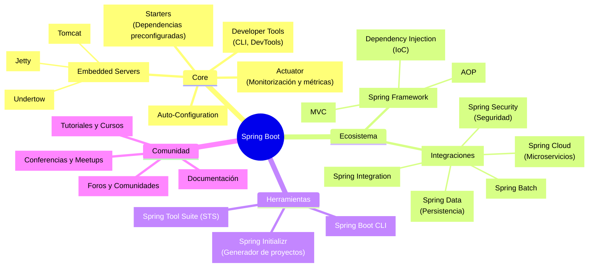

# Introducción a Spring Boot

Tu primer paso para crear microservicios en Java sin estrés

<footer class="absolute bottom-0px right-0px mx-6 my-4 text-md text-color-zinc-500 font-weigth-bold">

By: Jhordy Caceres ([@jhordycg](https://slides.jhordycg.dev))

</footer>

---
hideInToc: true
---

# Temario

<Toc/>


---
layout: default
---

# ¿Qué es?

Es una framework construido sobre el ecosistema de Spring, diseñado para simplificar el desarrollo, despliegue y gestion de aplicaciones basadas en Spring.

<br/>



---
layout: two-cols-header
---

# Características 

::left::

<v-clicks>

- <cib-github/> Open Source
    Código accesible y modificable, respaldado por una red global de desarrolladores que colaboran, reportan errores y proponen mejoras.

- <cib-read-the-docs/> Documentación detallada + tutoriales prácticos
    Guías paso a paso, ejemplos reales y referencias técnicas para acelerar el aprendizaje y la implementación de soluciones.

- <cib-stackoverflow/> Soporte robusto
    Acceso rápido a respuestas expertas, discusiones técnicas y soluciones validadas por la comunidad y los mantenedores del proyecto.

</v-clicks>

::right::

<v-clicks>

- <bi-boxes/> Enfoque en microservicios
    Diseñado para crear servicios independientes y escalables, facilitando el mantenimiento, la actualización y la escalabilidad selectiva.

- <cib-spring/> Ecosistema integrado
    Herramientas especializadas (seguridad, gestión de datos, procesos batch) que se integran sin esfuerzo, reduciendo la necesidad de librerías externas.

</v-clicks>

---
layout: intro
---

# Spring Boot Starters

Gestión Simplificada de Dependencias

---
layout: two-cols
hideInToc: true
---

# 🔍 **¿Qué són?**

Son enlatados de dependencias que nos ayudan a unificar un conjunto de dependencias para cumplir un objetivo especifico.

Los starters nacieron con el objetivo de evitar las: 

<v-clicks>

- **Dependencias en cascada**:  
  Cada funcionalidad principal (ej: API REST) requiere múltiples dependencias secundarias (JSON, HTTP, serialización, etc.).  
  → Ejemplo: `A → B → C → D` (versiones específicas requeridas).

- **"Whack-a-Mole" de Versiones**:  
  Conflictos entre versiones de librerías interdependientes.  
  ⚠️ Ejemplo: `Librería X v1.5` solo funciona con `Librería Y v2.3`.

</v-clicks>

::right::

````md magic-move {lines: true}
```xml
<!-- Ejemplo: spring-boot-starter-web -->
<dependency>
    <groupId>org.springframework.boot</groupId>
    <artifactId>spring-boot-starter-web</artifactId>
</dependency>
```

```xml {*|2-7|8-13|14-19|8-13}
<dependencies>
    <dependency>
      <groupId>org.springframework.boot</groupId>
      <artifactId>spring-boot-starter</artifactId>
      <version>3.4.2</version>
      <scope>compile</scope>
    </dependency>
    <dependency>
      <groupId>org.springframework.boot</groupId>
      <artifactId>spring-boot-starter-json</artifactId>
      <version>3.4.2</version>
      <scope>compile</scope>
    </dependency>
    <dependency>
      <groupId>org.springframework.boot</groupId>
      <artifactId>spring-boot-starter-tomcat</artifactId>
      <version>3.4.2</version>
      <scope>compile</scope>
    </dependency>
    <!--other dependencies-->
</dependencies>
```

```xml {*|2-8|9-14|15-20|*}
<dependencies>
    <!--other dependencies-->
    <dependency>
      <groupId>com.fasterxml.jackson.core</groupId>
      <artifactId>jackson-databind</artifactId>
      <version>2.18.2</version>
      <scope>compile</scope>
    </dependency>
    <dependency>
      <groupId>com.fasterxml.jackson.datatype</groupId>
      <artifactId>jackson-datatype-jdk8</artifactId>
      <version>2.18.2</version>
      <scope>compile</scope>
    </dependency>
    <dependency>
      <groupId>com.fasterxml.jackson.datatype</groupId>
      <artifactId>jackson-datatype-jsr310</artifactId>
      <version>2.18.2</version>
      <scope>compile</scope>
    </dependency>
    <!--other dependencies-->
  </dependencies>
```
```xml {7-12|*}
<dependencies>
    <dependency>
      <groupId>org.springframework.boot</groupId>
      <artifactId>spring-boot-starter</artifactId>
      <version>3.4.2</version>
      <scope>compile</scope>
    </dependency>
    <dependency>
      <groupId>org.springframework.boot</groupId>
      <artifactId>spring-boot-starter-json</artifactId>
      <version>3.4.2</version>
      <scope>compile</scope>
    </dependency>
    <dependency>
      <groupId>org.springframework.boot</groupId>
      <artifactId>spring-boot-starter-tomcat</artifactId>
      <version>3.4.2</version>
      <scope>compile</scope>
    </dependency>
    <!--other dependencies-->
</dependencies>
```

```xml
<!-- Ejemplo: spring-boot-starter-web -->
<dependency>
    <groupId>org.springframework.boot</groupId>
    <artifactId>spring-boot-starter-web</artifactId>
</dependency>
```
````

---
layout: default
hideInToc: true
---

# ✅ Beneficios Claves

<v-clicks>

- **Paquetes Pre-testeados:**

    - Todas las dependencias necesarias para una capacidad (ej: desarrollo web) en un solo starter.
    -- Posibilidad de override de versiones (con precaución ⚠️).
- Exclusión de dependencias no requeridas.
 Versiones sincronizadas y compatibles.

- **Reducción de Configuración:**

    - De 10-15 dependencias manuales → 1 starter.

- **Flexibilidad Controlada:**

    - Posibilidad de override de versiones (con precaución ⚠️).
    - Exclusión de dependencias no requeridas.

</v-clicks>

---
layout: default
hideInToc: true
---

# 📊 Impacto General

|Aspecto|	Antes|	Con Starters|
|----------|------|---------|
| Archivo de Build	|Largo y complejo|	Compacto y declarativo|
| Mantenimiento|	Alto esfuerzo de sincronización	|Automatizado|
| Testing|	Requerido para cada combinación|	Reducido (pre-validado)|

<br/>

✨ **Conclusión**: Los starters eliminan el "caza-conflictos" y aceleran el desarrollo con dependencias probadas y unificadas.

---
layout: intro
---

# ⚙️ Spring Boot Autoconfiguration

El arte de crear más, configurando menos

---
layout: default
hideInToc: true
---

# 🚀 **¿Qué es la Autoconfiguración?**

Espring boot reduce la configuración manual que en la mayoria de casos tendríamos que hacer, encargandose de detectar los *beans* e injectandolos automaticamente para su uso.

- **Superpoder del desarrollador**: Elimina código repetitivo mediante convenciones probadas.  

- **Filosofía**: *"Convención sobre configuración"* → Menos código, más funcionalidad.  

- **Ejemplo clave**:  
  ```java
  // añadiendo el starter: spring-boot-starter-web
    @RestController
    public class HelloController {
        @GetMapping("/hello")
        public String hello() {
            return "Hello, Spring Boot!";
        }
    }
  ```

---
layout: two-cols-header
hideInToc: true
---

# 🎯 **Beneficios Clave**

::left::

1. **Configuración Inteligente por Defecto**

    - **Base de datos**:  
        - Conexiones automáticas (abrir/cerrar).  
        - Consultas generadas desde nombres de métodos.

2. **Enfoque "Developer-First"**
    - **Entornos de desarrollo**:  
    ```properties
    # application.properties (opcional para desarrollo)
    spring.datasource.url=jdbc:h2:mem:testdb  
    spring.rabbitmq.host=localhost  
    ```
    - **Equipos**: Configuraciones compartidas que funcionan "out-of-the-box".  

::right::

3. **Flexibilidad Controlada**
    - **Personalización**:  
    ```properties
    # application-prd.properties (configuración para PRD)
    # Override para producción  
    spring.datasource.url=jdbc:postgresql://prod-db:5432/mydb  
    ```
    - **Deshabilitar autoconfiguración**: `@SpringBootApplication(exclude = {DataSourceAutoConfiguration.class})`

---
layout: default
hideInToc: true
---

# ⚠️ **Casos de Uso Atípicos (10-20%)**

<br/>

| Escenario                | Solución                          |  
|--------------------------|-----------------------------------|  
| Configuración muy específica | Definir propiedades o beans manualmente |  
| Librería no estándar      | Excluir autoconfiguraciones       |  

<br/>

> **⚠️ Advertencia**: Al sobre-escribir configuraciones, aumenta el testing para mitigar riesgos.

---
layout: default
hideInToc: true
---

# 📊 **Impacto en Productividad**

| **Sin Spring Boot**      | **Con Spring Boot**               |  
|--------------------------|-----------------------------------|  
| 100+ líneas de configuración | 0-10 líneas (convenciones)      |  
| Debugging de conexiones   | Conexiones gestionadas automáticamente |  
| Setup manual por entorno  | Defaults listos para desarrollo   |  

<br/>

✨ **Conclusión**: La autoconfiguración elimina el "código boilerplate", permitiéndote enfocarte en **lógica de negocio**, no en configuraciones repetitivas. ¡Tu superpoder para ser 10x más productivo! 🦸♂️


---
layout: intro
---

# 🚀 Spring Boot Despliegué Simplificado

Despliega fácil, rápido y sin limites.


---
hideInToc: true
---

# 🚀 Motivación

Realizar un despliegue era muy complejo, tomaba mucho tiempo y no era facilmente reproducible, algunos de los dolores eran:

<v-click>

**Despliegue Java pre-Spring Boot**:  

</v-click>

<v-clicks>

1. Instalar/Configurar servidores de aplicaciones (ej: Tomcat, WebSphere).  
2. Configurar controladores de base de datos manualmente.  
3. Crear pools de conexiones y recursos.  
4. Desplegar aplicación + **todas sus dependencias** en el servidor.  
5. Verificar compatibilidad de versiones entre componentes.  

</v-clicks>

<br/>

<v-click>

> **Resultado**: 🔧 **Horas de configuración** + ⚠️ **Riesgo de conflictos**.

</v-click>

---
layout: two-cols
hideInToc: true
---

## 🛠️ **Solución**  

Como solución nacieron los JAR Ejecutable de Spring Boot, los cuales eran generados automaticamente mediante un plugin de maven.

<br/>

```xml
<!-- Activación en pom.xml -->  
<build>  
    <plugins>  
        <plugin>  
            <groupId>org.springframework.boot</groupId>  
            <artifactId>spring-boot-maven-plugin</artifactId>  
        </plugin>  
    </plugins>  
</build>  
```

::right::

<v-click>

### ✅ **Beneficios Clave**

</v-click>

<v-clicks>

1. **Todo en Uno**:  
   - Aplicación + dependencias + servidor embebido en **1 archivo**.  

2. **Ejecución Simplificada**:  
   ```bash  
   # Con JVM instalada:  
   java -jar mi-app.jar
   ```  

3. **Nesting de JARs**:
   - Dependencias se mantienen en sus JARs originales.

4. **Portabilidad**:  
   - Funciona en **cualquier entorno con JVM**

</v-clicks>

---
layout: two-cols
hideInToc: true
---

## ⚙️ **¿Cómo Funciona?**

<v-clicks>

1. **Empaquetado**:  
   - El plugin de Maven/Gradle genera un JAR "fat" con estructura especial:  
     ```  
     BOOT-INF/  
     ├── classes/    # Código de tu app  
     └── lib/        # Todas las dependencias  
     META-INF/  
     org/            # Loader de Spring Boot  
     ```  

2. **Autoconfiguración del Servidor**:  
   - Spring Boot incluye Tomcat/Jetty **embebido**.  
   - Sin XMLs de configuración.  

</v-clicks>

::right::

<v-clicks>

📦 **Extracción de Contenidos**

```bash  
# Descomprimir el JAR ejecutable:  
jar -xf mi-app.jar
```  

**Usos comunes**:  
- Verificar dependencias incluidas.  
- Depurar problemas de classpath.  

</v-clicks>

---
hideInToc: true
---

# 🆚 **Comparativa de Despliegue**  
| **Antes**                          | **Con Spring Boot**               |  
|------------------------------------|------------------------------------|  
| Servidor externo requerido          | Servidor embebido en el JAR        |  
| 10+ pasos de configuración         | 1 comando: `java -jar`            |  
| Riesgo de versiones incompatibles   | Dependencias pre-empaquetadas     |  

<br/>

✨ **Conclusión**: Los JARs ejecutables eliminan la complejidad del despliegue tradicional, permitiendo **lanzar aplicaciones en segundos**. ¡Adiós a los servidores externos y hola a la simplicidad!  

---
layout: intro
---

# ¡Tu Primera App en Minutos! 👩💻

---

# Recursos

- [Spring Initializr](https://start.spring.io/#!type=maven-project&language=java&platformVersion=3.4.2&packaging=jar&jvmVersion=17&groupId=dev.jhordycg.spring&artifactId=mi-first-app&name=My%20First%20App&description=My%20First%20Application%20for%20Spring%20Boot&packageName=dev.jhordycg.spring.demo&dependencies=web,lombok)

- [Building an Application with Spring Boot](https://spring.io/guides/gs/rest-service)

---
layout: default
hideInToc: true
---

# Spring Beans

Los beans en spring son markadores que permiten al IoC Container de Spring *crear*, *gestionar* y *resolver*: 

```mermaid {scale: 0.8}
graph TD;
    A["@Component"] -->|Especialización| B["@Service"];
    A -->|Especialización| C["@Repository"];
    A -->|Especialización| D["@RestController"];
    D -->|Manejo de Excepciones| E["@RestControllerAdvice"];

    A -- "Clase genérica administrada por Spring" --> F["Clase de utilidad"];

    B -- "Para lógica de negocio" --> G["UserService"];
    C -- "Para acceso a datos" --> H["UserRepository"];
    D -- "Controlador REST" --> I["UserController"];
    E -- "Manejo de errores en controladores REST" --> J["GlobalExceptionHandler"];

    classDef bean fill:#000,stroke:#fff,stroke-width:1px;
    class A,B,C,D,E bean;
```



---
layout: default
hideInToc: true
---

# Injección de dependencia (DI / IoC)

Es un Patrón de diseño y uno de los principios solid que nos dice que trabajemos con abstracciones y no con implementaciones.

A continuación se muestran 3 formas de aplicarla:

````md magic-move {lines: true}
```java
    @Component
    class Cliente {
        @Autowired
        private Servicio servicio; // Inyección por campo

        public void realizarTarea() {
            servicio.ejecutar();
        }
    }
```
```java
    @Component
    class Cliente {
        private Servicio servicio;

        @Autowired
        public void setServicio(Servicio servicio) { // Inyección por método
            this.servicio = servicio;
        }

        public void realizarTarea() {
            servicio.ejecutar();
        }
    }
```
```java
    @Component
    class Cliente {
        private final Servicio servicio;

        @Autowired
        public Cliente(Servicio servicio) { // Inyección por constructor
            this.servicio = servicio;
        }

        public void realizarTarea() {
            servicio.ejecutar();
        }
    }
```
````

---
layout: center
hideInToc: true
---

# ¡Gracias!